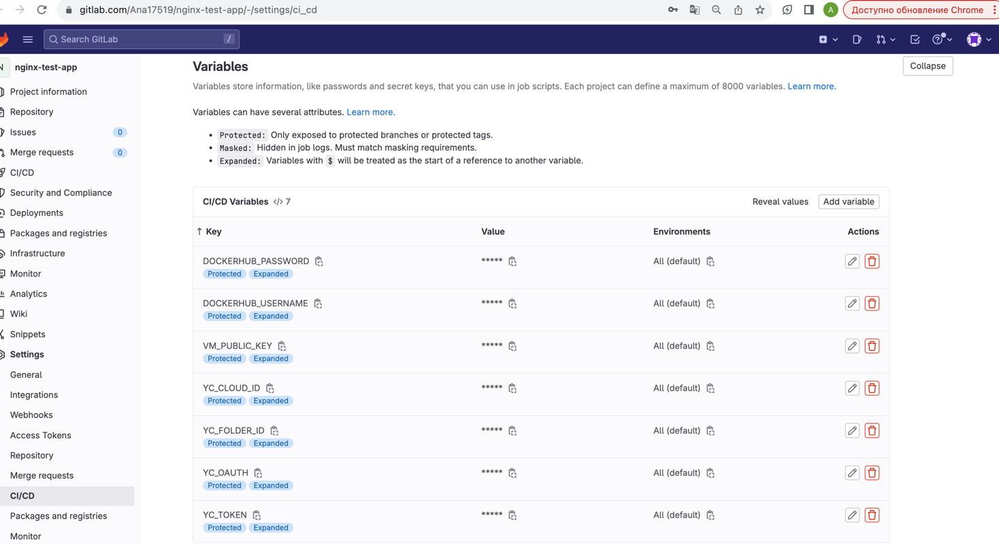

Установка и настройка CI/CD

Осталось настроить ci/cd систему для автоматической сборки docker image и деплоя приложения при изменении кода.

Цель:

* Автоматическая сборка docker образа при коммите в репозиторий с тестовым приложением.
* Автоматический деплой нового docker образа.
* Можно использовать teamcity, jenkins, GitLab CI или GitHub Actions.

Ожидаемый результат:

* Интерфейс ci/cd сервиса доступен по http.
* При любом коммите в репозиторий с тестовым приложением происходит сборка и отправка в регистр Docker образа.
* При создании тега (например, v1.0.0) происходит сборка и отправка с соответствующим label в регистри, 
а также деплой соответствующего Docker образа в кластер Kubernetes.


**Интерфейс ci/cd сервиса доступен по http:**

[gitlab](https://gitlab.com/Ana17519/)

**При любом коммите в репозиторие с тестовым приложением происходит сборка и отправка в регистр Docker образа:**

Импортировать репозиторий из github в GitLab CI/CD,
добавить в переменные проекта, значения взяв из yc config list:



[.gitlab-ci.yml](https://gitlab.com/Ana17519/nginx-test-app/-/blob/main/.gitlab-ci.yml) 


джоба успешна:


образ обновлен:


джоба:

[при любом коммите в репозиторий с тестовым приложением происходит сборка и отправка в регистр Docker образа.
](https://gitlab.com/Ana17519/nginx-test-app/-/jobs/5447487961)


**При создании тега (например, v1.0.0) происходит сборка и отправка с соответствующим label в регистри, 
а также деплой соответствующего Docker образа в кластер Kubernetes.**

нужно добавить новый раннер в кластер k8s (использую helm):

 ```
helm repo add gitlab https://charts.gitlab.io/
helm repo update
cat values.yaml
add runner-registration-token: "<registration-token>"
helm install gitlab/gitlab-runner -f values.yaml --generate-name
 ```

токен из settings -> cicd -> runners


обновить раннер, указав url:
 ```
 helm upgrade gitlab-runner-1699364625 --set \
 gitlabUrl=https://gitlab.com,runnerRegistrationToken=GR1348941JaRDxc6YRy5tgMtjU-Y_ gitlab/gitlab-runner
 ```


зарегистрировать раннер:

 ```
 kubectl exec -it gitlab-runner-1699364625-78cc7595b-k7sxb -- /bin/bash
 gitlab-runner reqister
 ```


в ui  добавила еще tag k8s на раннер kubernetes

variables:


Результаты:

[pipeline](https://gitlab.com/Ana17519/nginx-test-app/-/pipelines/1068109518)


[gitlab-ci.yaml](https://gitlab.com/Ana17519/nginx-test-app/-/blob/main/.gitlab-ci.yml)


джобы:
* [при создании тега (например, v1.0.0) сборка и отправка с соответствующим label в регистри](https://gitlab.com/Ana17519/nginx-test-app/-/jobs/5508829391)
* [деплой соответствующего Docker образа в кластер Kubernetes](https://gitlab.com/Ana17519/nginx-test-app/-/jobs/5508829396)

образ базовый обновлен:


[репозиторий](https://github.com/ana17519/nginx-test-app)

[склонированный репозиторий с gitlab ci](https://gitlab.com/Ana17519/nginx-test-app/-/tree/main)
