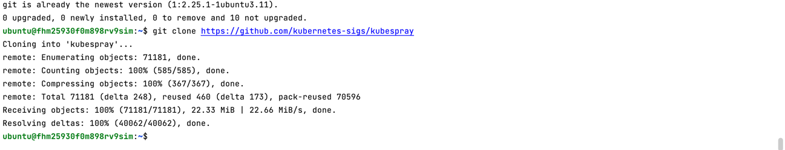
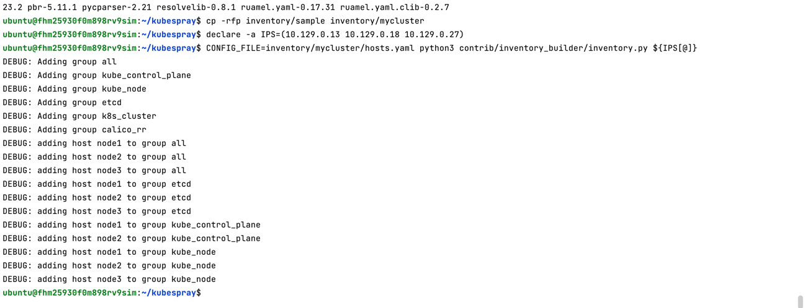
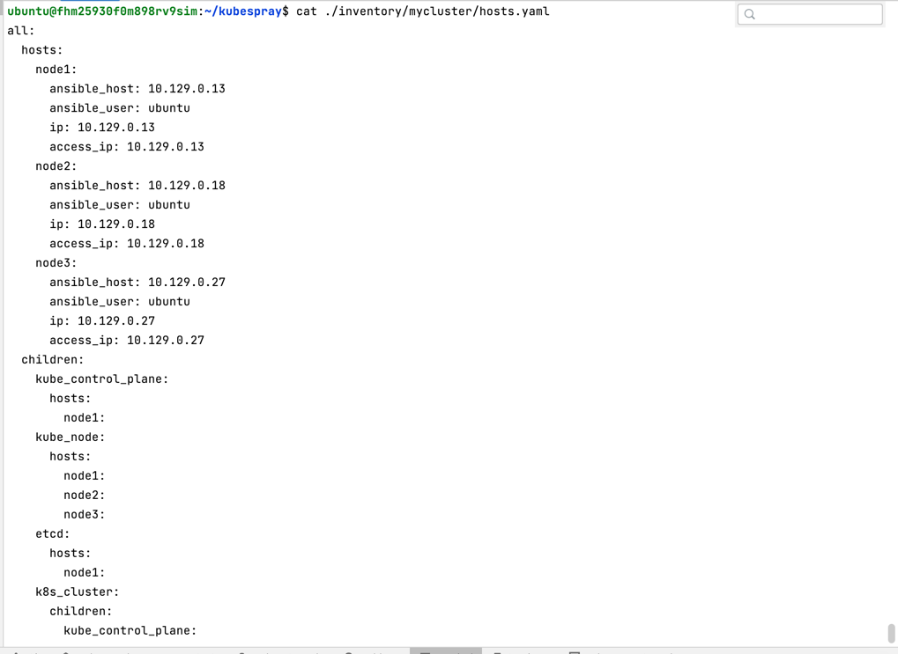
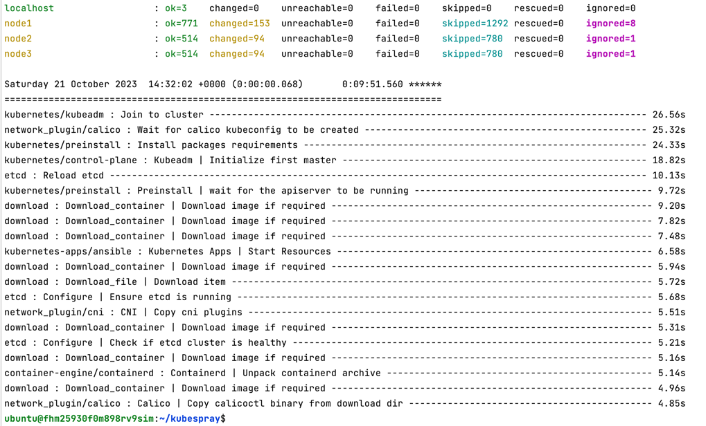
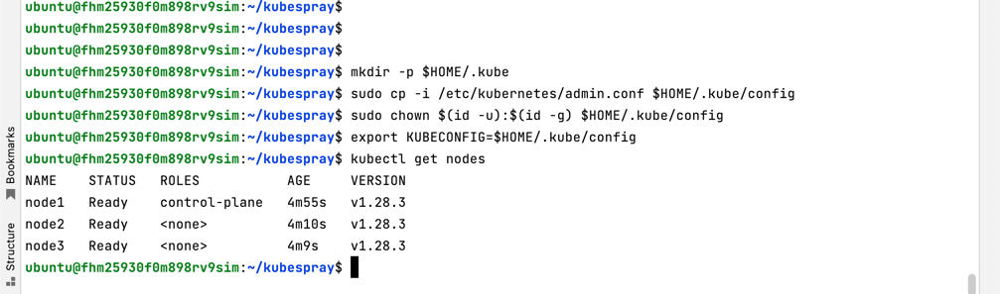
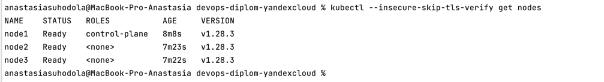

**Kubernetes кластер**

**Создание Kubernetes кластера**

На этом этапе необходимо создать [Kubernetes](https://kubernetes.io/ru/docs/concepts/overview/what-is-kubernetes/) кластер на базе предварительно созданной инфраструктуры.   Требуется обеспечить доступ к ресурсам из Интернета.

Это можно сделать двумя способами:

1. Рекомендуемый вариант: самостоятельная установка Kubernetes кластера.  
   а. При помощи Terraform подготовить как минимум 3 виртуальных машины Compute Cloud для создания Kubernetes-кластера. 
Тип виртуальной машины следует выбрать самостоятельно с учётом требовании к производительности и стоимости. 
Если в дальнейшем поймете, что необходимо сменить тип инстанса, используйте Terraform для внесения изменений.  
   б. Подготовить [ansible](https://www.ansible.com/) конфигурации, можно воспользоваться, например [Kubespray](https://kubernetes.io/docs/setup/production-environment/tools/kubespray/)  
   в. Задеплоить Kubernetes на подготовленные ранее инстансы, в случае нехватки каких-либо ресурсов вы всегда можете создать их при помощи Terraform.
2. Альтернативный вариант: воспользуйтесь сервисом [Yandex Managed Service for Kubernetes](https://cloud.yandex.ru/services/managed-kubernetes)  
  а. С помощью terraform resource для [kubernetes](https://registry.terraform.io/providers/yandex-cloud/yandex/latest/docs/resources/kubernetes_cluster) создать **региональный** мастер kubernetes с размещением нод в разных 3 подсетях      
  б. С помощью terraform resource для [kubernetes node group](https://registry.terraform.io/providers/yandex-cloud/yandex/latest/docs/resources/kubernetes_node_group)
  
Ожидаемый результат:

1. Работоспособный Kubernetes кластер.
2. В файле `~/.kube/config` находятся данные для доступа к кластеру.
3. Команда `kubectl get pods --all-namespaces` отрабатывает без ошибок.


Последовательность:

```
yc compute instance list
```


```
ssh ubuntu@51.250.90.227

sudo apt update
sudo apt install git
git clone https://github.com/kubernetes-sigs/kubespray
```


```
sudo apt-get install pip
cd kubespray/
sudo nano requirements.txt -> ansible==6.7.0

sudo pip3 install -r requirements.txt
cp -rfp inventory/sample inventory/mycluster
declare -a IPS=(10.128.0.35 10.128.0.29 10.128.0.21)
CONFIG_FILE=inventory/mycluster/hosts.yaml python3 contrib/inventory_builder/inventory.py ${IPS[@]}

```



после добавления ansible_user: ubuntu и etcd на master:

```
cat ./inventory/mycluster/hosts.yaml
```



добавлен приватный ключ и права, запуск плейбука:

```
nano ~/.ssh/id_rsa
sudo chmod 0700 ~/.ssh/id_rsa
ansible-playbook -i inventory/mycluster/hosts.yaml cluster.yml -b -v 
```


kubectl должен понимать к чему подключаться используя конфиг:

```
mkdir -p $HOME/.kube
sudo cp -i /etc/kubernetes/admin.conf $HOME/.kube/config
sudo chown $(id -u):$(id -g) $HOME/.kube/config
export KUBECONFIG=$HOME/.kube/config
kubectl get nodes
```



```
kubectl get pods --all-namespaces
kubectl cluster-info
```


обновить ip адрес в конфиг-файле, указав внешний ip виртуальной машины (master):

```
sudo nano ~/.kube/config
sudo cat ~/.kube/config
```
скопировать конфиг на локальную машину:

```
 scp ubuntu@51.250.90.227:/home/ubuntu/.kube/config ~/.kube
 cat ~/.kube/config
```



