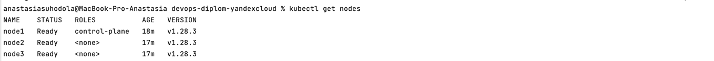

**Kubernetes кластер**

Последовательность:

```
yc compute instance list
```


```
ssh ubuntu@51.250.90.227

sudo apt update
sudo apt install git
git clone https://github.com/kubernetes-sigs/kubespray
```


```
sudo apt-get install pip
cd kubespray/
sudo nano requirements.txt -> ansible==6.7.0

sudo pip3 install -r requirements.txt
cp -rfp inventory/sample inventory/mycluster
declare -a IPS=(10.128.0.35 10.128.0.29 10.128.0.21)
CONFIG_FILE=inventory/mycluster/hosts.yaml python3 contrib/inventory_builder/inventory.py ${IPS[@]}

```


после добавления ansible_user: ubuntu и etcd на master:

```
cat ./inventory/mycluster/hosts.yaml
```


добавлен приватный ключ и права, запуск плейбука:

```
nano ~/.ssh/id_rsa
sudo chmod 0700 ~/.ssh/id_rsa
ansible-playbook -i inventory/mycluster/hosts.yaml cluster.yml -b -v 
```


kubectl должен понимать к чему подключаться используя конфиг:

```
mkdir -p $HOME/.kube
sudo cp -i /etc/kubernetes/admin.conf $HOME/.kube/config
sudo chown $(id -u):$(id -g) $HOME/.kube/config
export KUBECONFIG=$HOME/.kube/config
kubectl get nodes
```


```
kubectl get pods --all-namespaces
kubectl cluster-info
```


обновить ip адрес в конфиг-файле, указав внешний ip виртуальной машины (master):
```
sudo nano ~/.kube/config
sudo cat ~/.kube/config
```
скопировать конфиг на локальную машину:
```
 scp ubuntu@51.250.90.227:/home/ubuntu/.kube/config ~/.kube
 cat ~/.kube/config
```



