**Подготовка cистемы мониторинга и деплой приложения**

Уже должны быть готовы конфигурации для автоматического создания облачной инфраструктуры
и поднятия Kubernetes кластера.
Теперь необходимо подготовить конфигурационные файлы для настройки нашего Kubernetes кластера.

Цель:

1. **Задеплоить в кластер prometheus, grafana, alertmanager, экспортер основных метрик Kubernetes.**
2. **Задеплоить тестовое приложение, например, nginx сервер отдающий статическую страницу.**

Способ выполнения:

Воспользовать пакетом kube-prometheus, 
который уже включает в себя Kubernetes оператор для grafana, prometheus, alertmanager и node_exporter. 

Для организации конфигурации использовать qbec, основанный на jsonnet. 

Обратите внимание на имеющиеся функции для интеграции helm конфигов и helm charts

Если на первом этапе вы не воспользовались Terraform Cloud, то задеплойте и 
настройте в кластере atlantis для отслеживания изменений инфраструктуры. 

Альтернативный вариант 3 задания: вместо Terraform Cloud или atlantis настройте на автоматический запуск и 
применение конфигурации terraform из вашего git-репозитория в выбранной вами CI-CD системе при любом комите.

**Ожидаемый результат:**

* Git репозиторий с конфигурационными файлами для настройки Kubernetes.
* Http доступ к web интерфейсу grafana.
* Дашборды в grafana отображающие состояние Kubernetes кластера.
* Http доступ к тестовому приложению.


**Шаги:**

**1. Задеплоить в кластер prometheus, grafana, alertmanager, экспортер основных метрик Kubernetes**

репозиторий Prometheus для Helm и обновить список доступных пакетов:

```
helm repo add prometheus-community https://prometheus-community.github.io/helm-charts
helm repo update
```
пространство имен "monitoring":

```
kubectl create namespace monitoring
kubectl get ns 
```
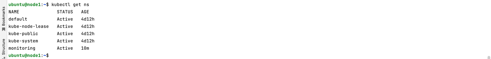

установить пакет kube-prometheus в пространство имен "monitoring" с помощью Helm:

```
helm install kube-prometheus-stack prometheus-community/kube-prometheus-stack --namespace monitoring

```

```
kubectl get pods -n monitoring
```
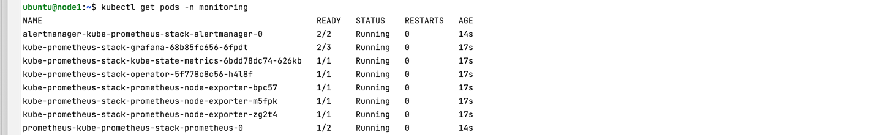

Проброс портов для доступа к Prometheus, Grafana и Alertmanager:

```
kubectl --namespace monitoring port-forward svc/kube-prometheus-stack-grafana 3000:80
kubectl --namespace monitoring port-forward svc/kube-prometheus-stack-alertmanager 9093:9093
kubectl --namespace monitoring port-forward svc/kube-prometheus-stack-prometheus 9090:9090

```
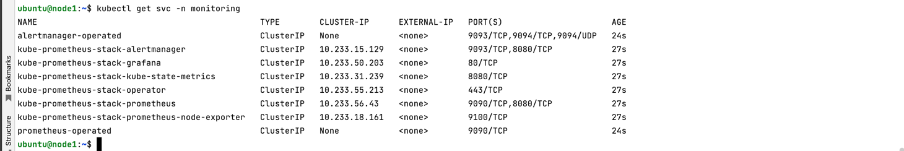

доступ к компонентам через ui:

- Prometheus: http://localhost:9090
- Grafana: http://localhost:3000 (admin:prom-operator)
- Alertmanager: http://localhost:9093

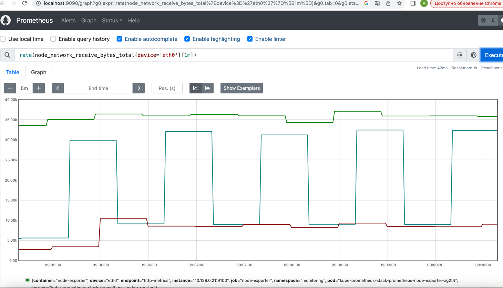
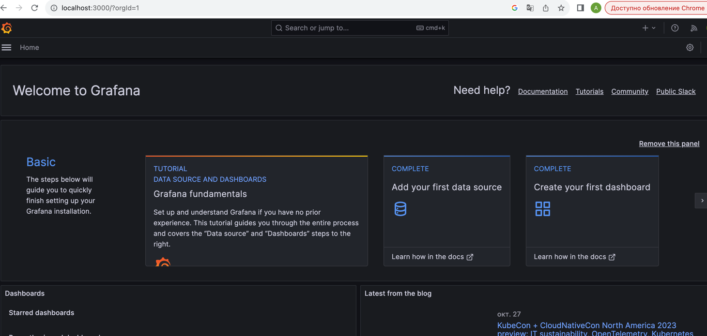
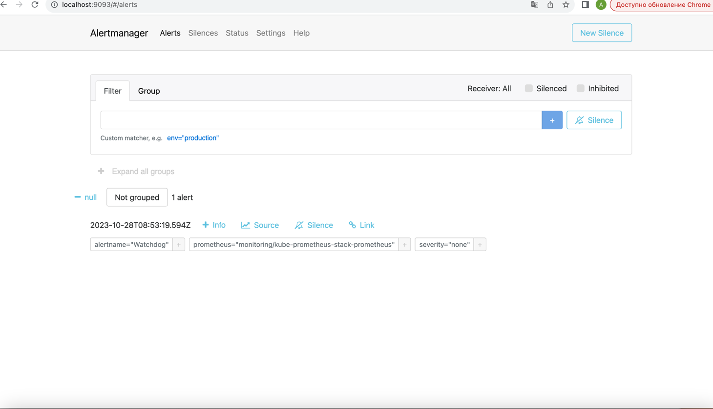


новый источник данных для Prometheus:

URL Prometheus: `http://kube-prometheus-stack-prometheus.monitoring.svc:9090` и нажмите "Save & Test".

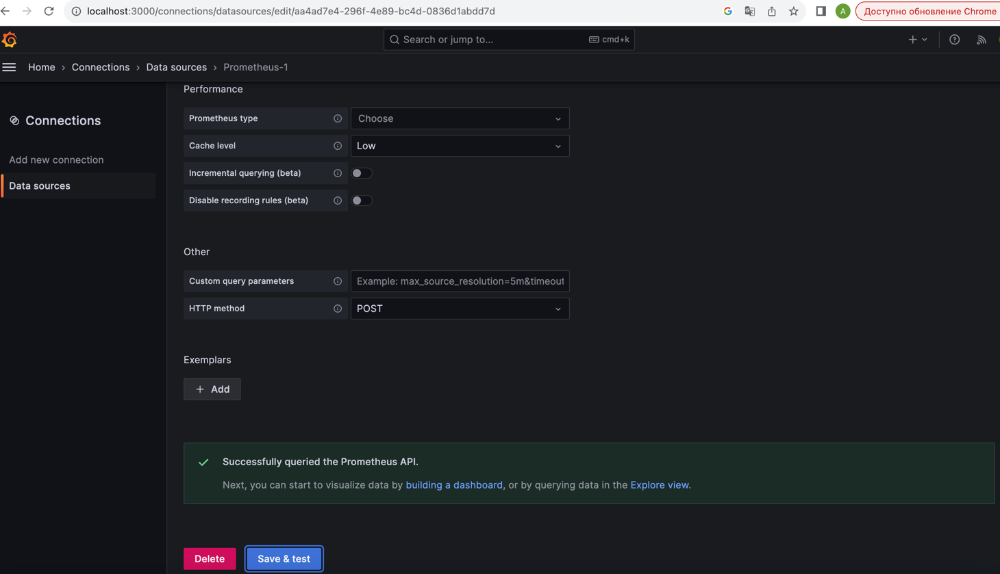

экспортеры в Grafana:

готовый дашборд для экспортера Node Exporter - "Node Exporter Full" с ID `1860` + источник данных Prometheus, указанный ранее

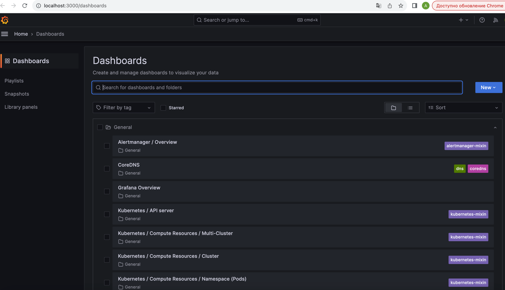
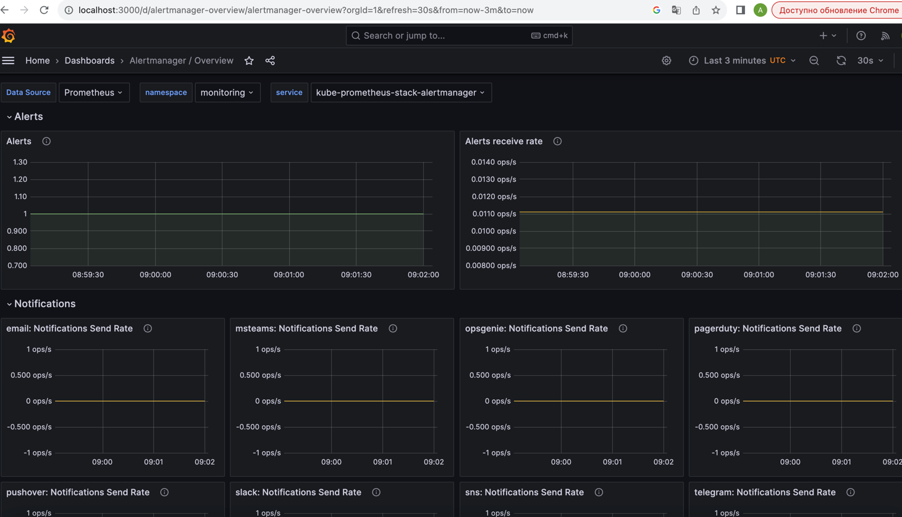
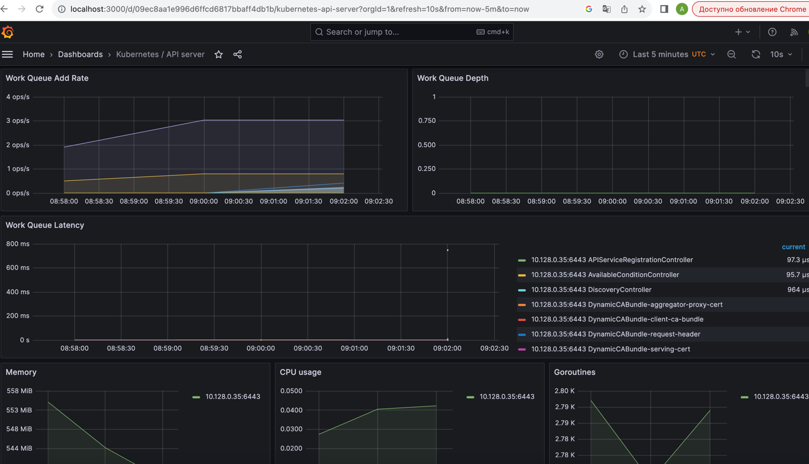
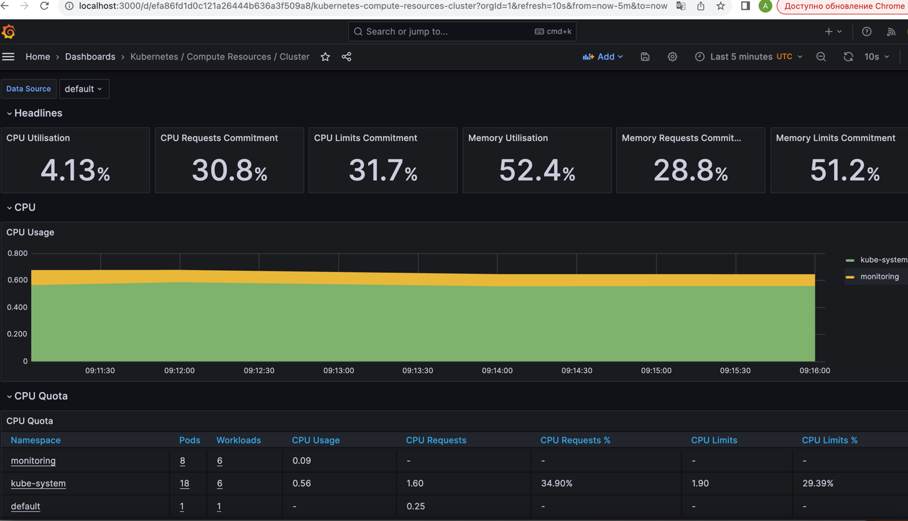

**2. Задеплоить тестовое приложение, например, 
nginx сервер отдающий статическую страницу.**

[манифест](monitoring/app.yaml) 

```
kubectl create ns app
kubectl apply -f app.yaml -n app
kubectl get deployments -n app
kubectl get pods -n app -o wide
kubectl get svc -n app
yc compute instance list
curl 158.160.126.34:30001
```

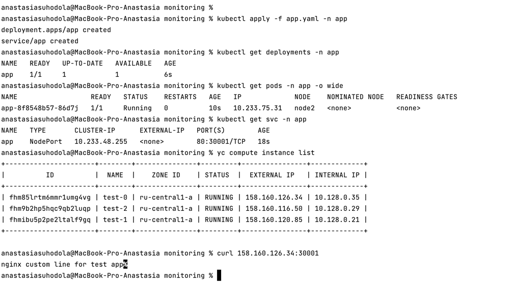
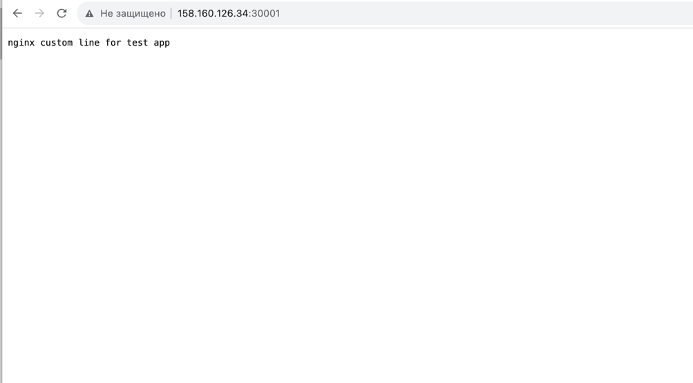

