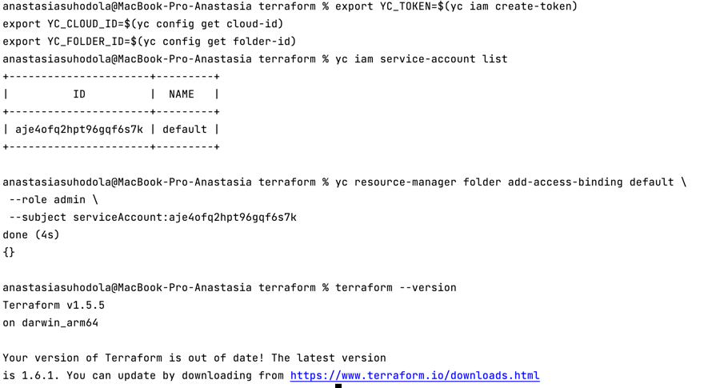
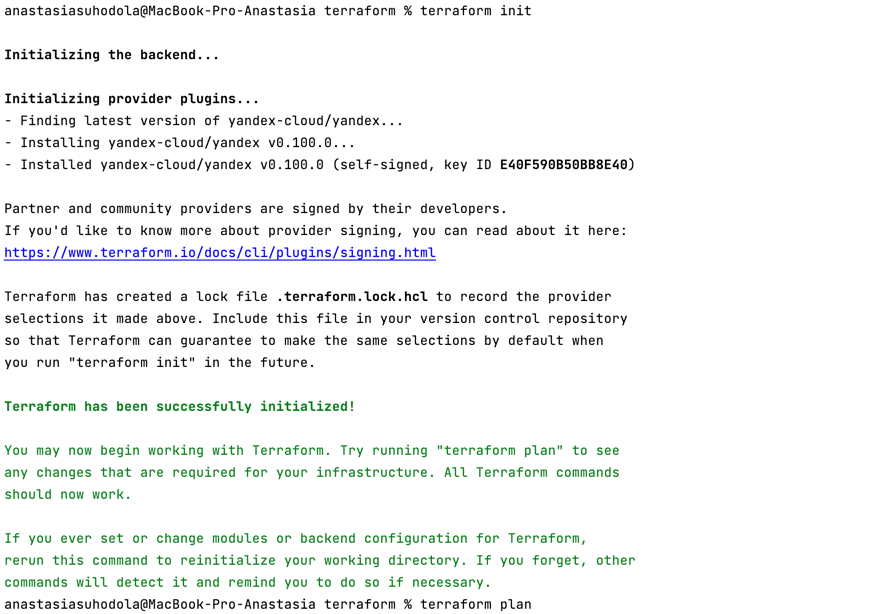
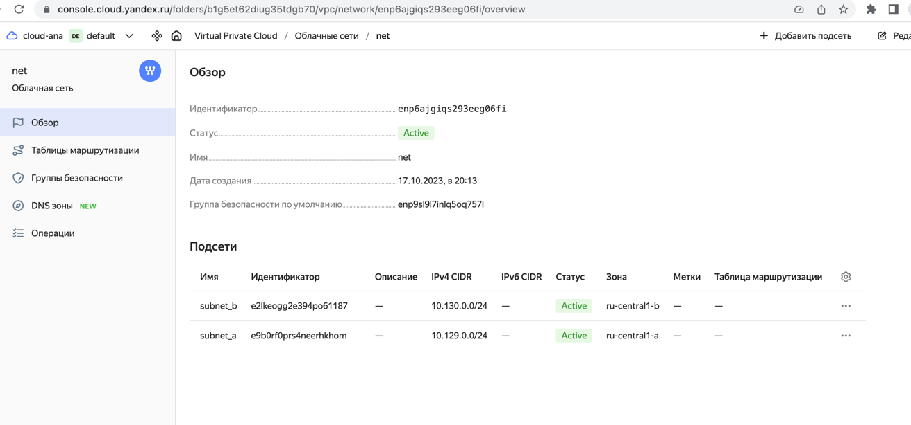
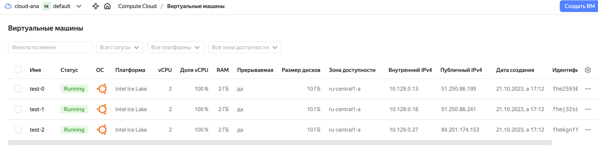
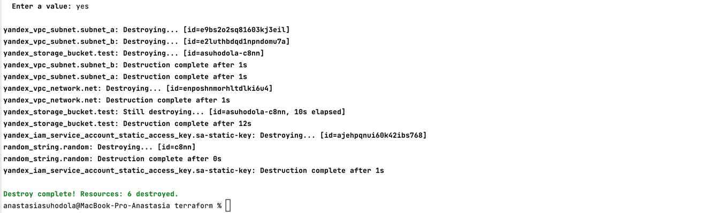

**Облачная инфраструктура**

Последовательность:

```
export YC_TOKEN=$(yc iam create-token)
export YC_CLOUD_ID=$(yc config get cloud-id)
export YC_FOLDER_ID=$(yc config get folder-id)

export ACCESS_KEY=""
export SECRET_KEY=""
```

сервисный аккаунт:

```
yc iam service-account list

yc resource-manager folder add-access-binding default \
 --role admin \
 --subject serviceAccount:aje4ofq2hpt96gqf6s7k
```



terraform init c указанием [backend-config](https://cloud.yandex.ru/docs/tutorials/infrastructure-management/terraform-state-storage#create-service-account): 

```     
terraform init -backend-config="access_key=$ACCESS_KEY" -backend-config="secret_key=$SECRET_KEY"
```



```
terraform apply:
```


vm:



```
terraform destroy:
```


Файлы:

* [vars.tf](vars.tf)
* [main.tf](main.tf)
* [versions.tf](versions.tf)